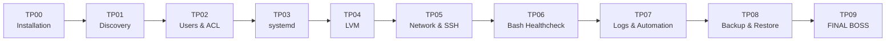

# B3 Linux SysAdmin Bootcamp

> **B3_SRC_26_1 — Système d'exploitation Linux**
> Bachelor 3 Systèmes, Réseaux & Cloud — **13 heures** — approche 100 % orientée administration et exploitation.

Ce dépôt contient le support étudiant d'un mini-bootcamp Linux construit autour d'un fil rouge : vous intégrez l'équipe Infrastructure de **NovaTech** et prenez en charge le serveur `srv-linux01`.

L'objectif n'est pas de mémoriser une liste de commandes. À la fin du module, vous devez être capable de **installer, administrer, sécuriser, automatiser et dépanner un serveur Linux** en justifiant vos choix.

## Parcours



| Journée | Thème | TPs | Durée TP cible |
|---|---|---|---:|
| Jour 1 | Construire et administrer un serveur | TP00 → TP04 | ~5 h |
| Jour 2 | Exploiter, automatiser, sécuriser et dépanner | TP05 → TP09 | ~5 h |

La théorie et les démonstrations complètent ces TPs pour atteindre les **13 h** du module.

## Compétences travaillées

- installation et prise en main d'un serveur Ubuntu ;
- filesystem, CLI, pipes et redirections ;
- utilisateurs, groupes, permissions, `sudo` et ACL POSIX ;
- processus, services, `systemd` et `journalctl` ;
- stockage, filesystems, montage persistant et LVM ;
- diagnostic réseau avec `ip`, `ss`, DNS et HTTP ;
- SSH et durcissement de base ;
- scripting Bash et codes de retour ;
- logs, `cron`, `logrotate` et systemd timers ;
- sauvegarde **et restauration vérifiée** ;
- méthodologie de troubleshooting et gestion d'un incident P1.

## Pré-requis

### VM recommandée

```text
OS             : Ubuntu Server 24.04 LTS
CPU            : 2 vCPU
RAM            : 2 à 4 Go
Disque système : 20 Go minimum
Disque data    : 5 Go minimum, vierge au démarrage
Réseau         : 1 interface avec accès Internet
Compte          : utilisateur avec sudo
```

Les détails sont dans [`docs/environment.md`](docs/environment.md).

## Démarrage rapide

```bash
sudo apt update
sudo apt install -y git

git clone <URL_DU_REPO>
cd b3-linux-sysadmin-bootcamp
```

Commencez ensuite par :

1. [`labs/day-1/TP00-installation/README.md`](labs/day-1/TP00-installation/README.md)
2. puis suivez la progression TP00 → TP09.

> [!IMPORTANT]
> Les TPs sont conçus pour être réalisés **dans l'ordre sur la même VM**. Le serveur construit au Jour 1 devient votre serveur d'exploitation au Jour 2.

## Niveaux de difficulté

- 🟢 **GUIDÉ** — étapes et commandes principales fournies ;
- 🟠 **CHALLENGE** — résultat attendu, mais une partie de la méthode est à trouver ;
- 🔴 **EXPERT** — besoin métier, autonomie maximale.

Les challenges ne sont pas obligatoires pour avancer, mais ils évitent qu'un étudiant rapide termine le module trop tôt.

## Validateurs automatiques

Chaque TP jusqu'au TP08 possède un validateur local.

Exemple :

```bash
sudo ./scripts/checks/check-tp04.sh
```

Validation d'une journée :

```bash
sudo ./scripts/checks/check-all-day1.sh
sudo ./scripts/checks/check-all-day2.sh
```

Les validateurs utilisent :

```text
PASS   → objectif validé
FAIL   → correction nécessaire
WARN   → vérification manuelle ou contexte particulier
BONUS  → objectif avancé validé
```

> [!NOTE]
> Un validateur ne remplace pas l'explication technique. Une configuration peut fonctionner et rester mal comprise.

## Supports de cours

Les deux présentations sont disponibles en **PowerPoint** et en **PDF** pour consultation directe :

| Support | PowerPoint | PDF |
|---|---|---|
| Jour 1 — Linux Fundamentals | [PPTX](slides/B3_SRC_26_1_J1_Linux_Fundamentals_V3.pptx) | [PDF](slides/B3_SRC_26_1_J1_Linux_Fundamentals_V3.pdf) |
| Jour 2 — Linux Operations | [PPTX](slides/B3_SRC_26_1_J2_Linux_Operations_V3.pptx) | [PDF](slides/B3_SRC_26_1_J2_Linux_Operations_V3.pdf) |

## Cheatsheets

- [`commands.md`](cheatsheets/commands.md) — commandes essentielles ;
- [`permissions.md`](cheatsheets/permissions.md) — permissions et droits ;
- [`systemd.md`](cheatsheets/systemd.md) — services et journal ;
- [`troubleshooting.md`](cheatsheets/troubleshooting.md) — méthode de diagnostic.

## Final Boss

Le dernier TP n'est pas un QCM ni un CTF. C'est un **incident d'exploitation contrôlé**.

```text
INC-26001 — srv-linux01 indisponible
```

Votre mission est de :

1. observer les symptômes ;
2. collecter des faits ;
3. formuler une hypothèse ;
4. corriger le minimum nécessaire ;
5. valider le retour à la normale ;
6. produire une mini-RCA.

Le scénario exact est injecté par le formateur et n'est volontairement pas présent dans ce dépôt public.

## Livrables

Le dossier `livrables/` est prévu pour vos notes et scripts de travail. Il est ignoré par Git par défaut afin d'éviter de publier accidentellement des réponses ou des informations de VM.

Voir [`livrables/README.md`](livrables/README.md).

## Évaluation indicative

| Élément | Pondération |
|---|---:|
| TPs et validations | 30 % |
| QCM / connaissances | 20 % |
| Incident final | 40 % |
| Explication technique / restitution | 10 % |

Détails : [`docs/assessment.md`](docs/assessment.md).

## Structure du dépôt

```text
.
├── .github/workflows/      # contrôle syntaxique des scripts
├── cheatsheets/            # fiches mémo
├── docs/                   # environnement, planning, évaluation, publication
├── labs/
│   ├── day-1/              # TP00 → TP04
│   └── day-2/              # TP05 → TP09
├── livrables/              # travail local étudiant, non publié
├── scripts/checks/         # validateurs automatiques
└── slides/                 # PPTX + PDF
```

## Philosophie du module

> **Observer avant de corriger. Comprendre avant d'automatiser. Tester avant de déclarer que c'est terminé.**

Ce dépôt est volontairement orienté pratique : l'étudiant passe progressivement d'un TP guidé à une situation où seul le besoin opérationnel lui est donné.

## Auteur

**Gaëtan Perruche** — support pédagogique B3 Systèmes, Réseaux & Cloud.

## Licence

- supports pédagogiques, TPs, documentation et slides : **CC BY-NC-SA 4.0** ;
- scripts présents dans `scripts/` : **MIT**.

Voir [`LICENSE.md`](LICENSE.md).
